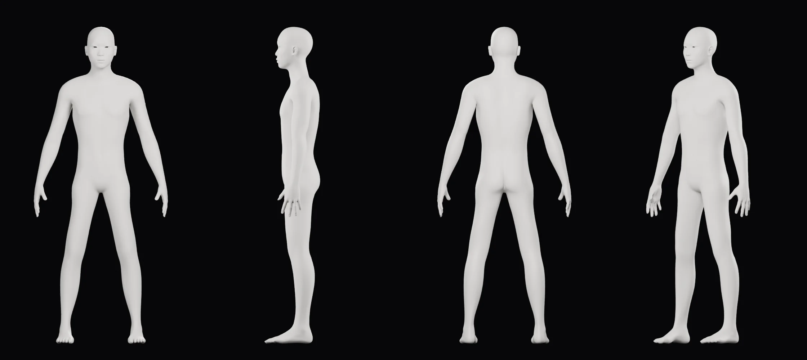

# CORPUS — 착용자(도하) 해부학 분석

> **작성** Claude · 2026-10-02 · P1-A  
> **입력** 도하 신체 정보: 남성, 20대 초반(22세로 계산), 키 178 cm, 윙스팬 182 cm, 체중 65 kg(브리프), 체지방률 10 %, 근육량 평균 소폭 이상  
> **용도** ① 착용자 마네킹(previs, P2 바디의 출발점) ② 스토리보드 CORPUS 챕터 ③ 엔지니어링 계산서(분절 질량·길이) ④ 슈트 착용성 검사  
> **용도가 아닌 것** 슈트 패널 디자인. 패널은 도하의 레퍼런스를 그대로 따른다(도하 결정 2026-10-02 청사진, 2026-10-03 새 레퍼런스). 근육 데이터는 센서 위치, 제어 모델, 숨은 기능 배치에만 쓴다.

## 0. 요약

| 항목 | 결과 | 근거 |
|---|---|---|
| 허리둘레(배꼽 높이) | **71.0 cm** (90 % 구간 약 66~76) | NHANES DXA 회귀 + 측정 부위 보정. 65 cm는 폐기 |
| 허리둘레(장골능 높이) | 72.2 cm | NHANES 2011–12, 18–35세 남성 776명 회귀 (R² 0.93) |
| 어깨(삼각근) 너비 | **47.0 cm** (44.5~49.6) | ANSUR II 조건부 예측. 이전 마네킹 53.2 cm는 6 cm 과대 |
| 어깨뼈(견봉) 너비 | 41.3 cm | ANSUR II |
| 가슴둘레 | 93.1 cm | ANSUR II |
| 체지방(DXA 환산) | **11 %** 채택 | BIA 10 % → DXA 10~15 % 시나리오 중 도하의 '근육 평균 소폭 이상' 진술과 맞는 값 |
| 제지방량 / FFMI | 57.9 kg / 18.3 | 미국 20대 남성 중 33번째 백분위, **아시아계 20대 남성 중 약 55번째 백분위** = '평균 소폭 이상'과 일치 |
| 골격근량 | 약 30 kg (체중의 46 %) | Kim 2002 DXA 식 |
| 앉은키 | 94.1 cm (73번째 백분위) | 상체가 길고 다리가 상대적으로 짧은 동아시아 비율 |
| 가랑이 높이 | **84.7 cm** | 슈트(밑창 3.5 cm 포함)로는 약 88 cm. **드로잉의 가랑이 약 81 cm보다 7 cm 높다** → §6 |
| 마네킹 적합도 | 측정 39항목 전부 통계 오차 범위 안 (|z| ≤ 1.2, χ²/항목 0.26) | `previs/fit_corpus.py` |

## 1. 데이터와 접근 제약

| 데이터 | 내용 | 확보 경로 |
|---|---|---|
| **NHANES 2011–2012** (미 CDC, 공공) | DEMO_G, BMX_G, DXX_G. Hologic DXA 전신 체성분 + 신체 계측 | CDC 서버는 이 환경의 네트워크 정책으로 차단 → GitHub 공개 미러(원본 XPT 파일) |
| **ANSUR II** (2012 미 육군 인체 측정, 공공) | 남성 4,082명, 93개 치수(윙스팬 포함), 아시아계 117명 | PSU 서버 차단 → GitHub 공개 미러 |
| **OpenSim Rajagopal 2016** | 하지 근육 40개/다리의 근력, 최적 섬유 길이, 깃각, 부착 경로 (Handsfield 2014 MRI 부피 기반) | opensim-org GitHub |
| **MoBL-ARMS** (Saul 2015, Holzbaur 2005 기반) | 어깨·상지 근육 50개 | CEINMS-RT GitHub (Apache-2.0) |
| MakeHuman/MPFB2 | 기본 메시와 형태 타깃 281개(CC0), 측정 루프 | GitHub |

차단되어 쓰지 못한 출처: wwwn.cdc.gov(다른 NHANES 주기), simtk.org(흉요추 근육 모델), PMC·Nature 원문. 결과적으로 **몸통 근육(승모근, 복직근, 복사근, 척추세움근 등)은 부피 수치 없이 이름과 위치만** 스토리보드에 쓴다. 환경 설정에서 이 도메인을 허용하면 P2에서 보강할 수 있다.

## 2. 체성분 (CORPUS-1, `corpus/bodycomp.py` → `bodycomp.json`)

**문제**: 체지방 10 %는 체성분계(BIA, 보통 InBody)로 잰 값으로 보인다. NHANES는 DXA 기준이다. 마른 남성에서 두 방식의 차이는 문헌마다 방향이 다르다(대학생 남성에서는 BIA가 낮게, 대규모 중국인 코호트의 체지방 15 % 미만 남성에서는 BIA가 높게 잼). 그래서 DXA 10 / 12.5 / 15 % 세 시나리오로 계산했다.

| DXA 체지방 | 제지방량 | FFMI | 미국 20대 남성 백분위 | 아시아계 20대 남성 백분위 | 허리(장골능) |
|---|---|---|---|---|---|
| 10 % | 58.5 kg | 18.5 | 36 | 59 | 71.6 cm |
| 12.5 % | 56.9 kg | 18.0 | 30 | 51 | 72.7 cm |
| 15 % | 55.3 kg | 17.4 | 20 | 38 | 73.9 cm |

**채택: DXA 11 %.** 도하의 두 진술(체지방 10 %, 근육 평균 소폭 이상)이 동시에 성립하는 구간이 10~12.5 %다. 15 %라면 근육량이 평균 이하가 되어 진술과 어긋난다.

**교차 검증**
- NHANES에서 키 173~183 cm, 체중 60~70 kg, DXA 체지방 17 % 미만인 실제 남성 14명: 허리(장골능) 평균 **74.0 ± 4.0 cm**(평균 체지방 15 %로 도하보다 덜 마름).
- 미 해군 둘레식: 체지방 10 %면 허리 − 목 = 39.5 cm. 목 35.7 cm를 넣으면 허리 75 cm.
- RFM 식(Woolcott 2018)은 66 cm를 주지만 이 식은 극단적인 저체지방에서 정확도가 떨어진다. 65 cm 근처라는 직관은 이 식과 같은 계열의 오차다.

**부위별 제지방(DXA)**: 양팔 6.9 kg, 양다리 19.0 kg, 몸통 26.6 kg. 사지 제지방 25.9 kg → 골격근량 약 30 kg(Kim 2002).

## 3. 인체 치수 (CORPUS-2, `corpus/anthro.py` → `anthro.json`)

### 3.1 방법
ANSUR II의 93개 치수 각각을 키, 윙스팬, 체중, 배꼽 허리둘레, 나이, 아시아계 여부로 예측했다(로그 선형 모델). 도하는 ANSUR 표본에서 매우 마른 쪽 꼬리에 있으므로(BMI 20.5, 표본 평균 27.7) 전체 회귀는 외삽이 된다. 그래서 **도하와 비슷한 사람에게 가중치를 몰아 준 국소 회귀**(가우시안 커널, 유효 표본 350명)를 채택했다. 허리둘레의 불확실성(±2.5 cm)은 예측 구간에 전파했다.

### 3.2 주요 치수 (mm, 90 % 예측 구간, 미 육군 남성 중 백분위)

| 치수 | 예측 | 구간 | 백분위 | 마네킹 |
|---|---:|---|---:|---:|
| 키 / 윙스팬 | 1780 / 1820 | 도하 실측 | 64 / 54 | 1780 / 1821 |
| 견봉 높이 | 1451 | 1420–1482 | 57 | 1462 |
| 흉골 상단(목 아래 패인 곳) 높이 | 1444 | 1425–1464 | 55 | 1446 |
| 제7경추 높이 | 1525 | 1506–1543 | 55 | 1524 |
| 젖꼭지 높이 | 1317 | 1283–1352 | 68 | 1299 |
| 배꼽 높이 | 1067 | 1036–1100 | 58 | 1069 |
| 대전자 높이 | 897 | 855–942 | 49 | 877 |
| 가랑이 높이 | 847 | 811–885 | 53 | 849 |
| 무릎(슬개골 중앙) 높이 | 485 | 460–511 | 47 | 492 |
| 견봉 너비 | 413 | 388–439 | 44 | 413 |
| **삼각근 너비** | **470** | 445–496 | 10 | 472 |
| 가슴둘레 | 931 | 883–982 | 6 | 915 |
| **허리둘레(배꼽)** | **711** | 조건값 | 0.5 | 710 |
| 엉덩이둘레 | 885 | 849–924 | 4 | 863 |
| 목둘레 | 357 | 337–378 | 4 | 358 |
| 위팔둘레(이완, NHANES) | 295 | 266–322 | – | 293 |
| 허벅지둘레 | 517 | 488–548 | 3 | 503 |
| 종아리둘레 | 359 | 335–385 | 13 | 359 |
| 위팔 길이(견봉–요골두) | 333 | 318–349 | 46 | 334 |
| 아래팔 길이(요골두–경상돌기) | 267 | 252–283 | 48 | 267 |
| 손 길이 / 발 길이 | 196 / 270 | | 61 / 45 | 195 / 273 |
| 앉은키 | 941 | 905–978 | 73 | – |

**해석**: 길이 치수는 미 육군 평균 근처(45~65번째 백분위)이고, 둘레와 너비는 체지방이 낮아서 하위 10 % 안쪽이다. 마른 체형이지만 비율은 표준적이다. 앉은키가 73번째 백분위라서 상체가 길고 다리가 상대적으로 짧다(동아시아인의 전형적인 비율). 윙스팬/키 비율 1.022는 이 집단 평균(1.033)보다 약간 작다. '팔이 긴 체형'은 아니다.

### 3.3 맞추지 않은 치수와 이유
- **가슴 너비**: ANSUR는 겨드랑이 앞선 사이를 캘리퍼스로 잰다. 메시의 최대 몸통 너비와 정의가 달라서 제외했다.
- **목 밑둘레**: 줄자는 승모근 뿌리 위를 지나지만, 평면 단면은 어깨 경사를 따라 멀리 나간다. 제외했다.
- 겨드랑이 높이, 10번 갈비뼈 높이, 앉은키: 피부 메시에서 정의할 수 없거나 앉은 자세가 필요하다.

## 4. 근육 표 (CORPUS-3, `corpus/muscles.py` → `muscles.json`)

부피 = 최대 근력 × 최적 섬유 길이 ÷ 비장력. 비장력은 Rajagopal 모델 60 N/cm², Holzbaur 기반 상지 모델 140 N/cm²(어깨·팔꿈치)와 45 N/cm²(전완·손)를 그대로 썼다. 도하의 키×체중과 제지방 비율로 크기를 맞췄다(하지 ×0.97, 상지 ×0.92).

| 근육 | 한쪽 부피 (cm³) | 생리적 단면적 (cm²) | 섬유 길이 (cm) |
|---|---:|---:|---:|
| 큰볼기근 gluteus maximus | 846 | 53.9 | 15.7 |
| 가쪽넓은근 vastus lateralis | 827 | 83.2 | 9.9 |
| 큰모음근 adductor magnus | 556 | 38.6 | 14.9 |
| 가자미근 soleus | 440 | 100.1 | 4.4 |
| 안쪽넓은근 vastus medialis | 430 | 44.4 | 9.7 |
| 중간볼기근 gluteus medius | 322 | 44.1 | 7.3 |
| 넙다리곧은근 rectus femoris | 269 | 35.4 | 7.6 |
| 장딴지근 안쪽갈래 gastrocnemius med. | 257 | 50.3 | 5.1 |
| 위팔세갈래근 triceps brachii | 175 | 14.5 | 12.2 |
| 넙다리빗근 sartorius | 162 | 4.0 | 40.3 |
| 큰가슴근 pectoralis major* | 148 | 10.5 | 14.0 |
| 앞정강근 tibialis anterior | 135 | 19.8 | 6.8 |
| 넓은등근 latissimus dorsi* | 132 | 5.2 | 25.3 |
| 어깨세모근 앞/중간 deltoid ant./mid | 78 / 78 | 8.0 / 7.3 | 9.8 / 10.8 |
| 위팔두갈래근 biceps brachii | 68 | 5.5 | 12.2 |

\* 상지 모델의 단면적은 고령 사체 계측에서 온 값이라 젊은 남성의 실제 부피보다 작게 나온다(큰가슴근은 MRI 문헌에서 보통 2배 이상). 스토리보드 수치로는 하지 값을 주로 쓰고, 상지 값은 상대 크기 정도로만 쓴다.

교차 검증: 모델의 하지 근육 합계 14.5 kg(양쪽) vs DXA 다리 제지방 19.0 kg. 근육은 사지 제지방의 약 75 %라는 일반적인 비율과 맞는다.

## 5. 마네킹 (previs, `previs/body.py` + `previs/fit_corpus.py` → `previs/wearer_fit.json`)

- **기본 형태**: MakeHuman 기본 메시 + **아시아 남성 형태 타깃**(이전 마네킹에는 인종·성별 형태가 빠져 있어서 가슴 등을 따로 눌러야 했다) + 근육/체중 매크로 + 슬라이더 59개.
- **측정**: ANSUR 정의를 따라 랜드마크 16개(견봉, 요골두, 경상돌기, 중지 끝, 제7경추, 흉골 상단, 젖꼭지, 배꼽, 대전자, 가랑이, 슬개골, 대퇴 외측상과, 외측 복사뼈, 발뒤꿈치, 발끝, 정수리)를 정점 번호로 고정하고, 둘레는 평면 단면의 볼록 껍질(줄자와 같은 원리)로 잰다. 윙스팬은 T자세에서 잰다.
- **적합**: 최대사후확률(MAP) 추정. 각 치수의 통계 불확실성과 '메시 측정 vs 사람 측정'의 정의 오차를 합친 σ로 잔차를 나누고, 모든 슬라이더에 약한 사전분포를 둔다. 결과: χ²/항목 0.26, 최대 |z| 1.19(외측 복사뼈 높이, 정의 차이).
- **자세**: 드로잉의 A자세(위팔 17°), 팔꿈치는 거의 편 8°. MakeHuman 기본 자세는 팔꿈치가 47° 굽어 있어서 전완 사슬을 스킨 웨이트로 폈다.

## 6. 슈트 착용성에 주는 영향 (G1 확인 사항)

| 항목 | 드로잉 (184 cm 슈트 높이로 환산) | 착용자 + 슈트 | 판정 |
|---|---|---|---|
| 가랑이 | 약 81 cm | 84.7 + 밑창 3.5 = **88 cm** | 🔧 **다리 쪽 비율만 약 7 cm 늘림.** 그대로 두면 골반 V판이 허벅지 사이로 7 cm 내려와 걷거나 앉을 때 부딪힌다 |
| 무릎 중심 | 약 51 cm | 48.9 + 3.5 = 52.4 cm | ✅ 1.4 cm 차이, 거의 그대로 |
| 어깨 외곽 | 62 cm | 착용자 삼각근 47 cm | ✅ 한쪽 7.5 cm 여유 = 어깨 풀리와 패널 수납 공간 |
| 허리 최소 폭 | 29 cm | 착용자 허리 너비 25.8 cm | ✅ 한쪽 1.6 cm. 라이너와 패널 두께로 빠듯하지만 가능 |
| 전완 폭 | 약 14 cm | 착용자 약 8.7 cm | ✅ 툴 베이와 보조 손 수납 |

**제안**: 상체는 드로잉 비율 그대로, 다리만 착용자에게 맞춘다(가랑이 +7 cm, 무릎 +1.4 cm, 발목 이하 그대로). G1에서 전후 비교 이미지로 확인받는다.

## 7. P2에서 하는 일 (이 분석과의 경계)

P1-A는 **데이터와 previs 마네킹**까지다. P2는 이것을 제작용으로 바꾼다:
1. 제작용 착용자 바디: 변형에 강한 깨끗한 토폴로지, 관절 중심(고관절은 Harrington 회귀 등)과 가동 범위가 있는 리그, 주요 자세 스키닝 테스트.
2. 슈트 외형은 도하의 새 레퍼런스에서 판 단위로 만든다([`../INTAKE.md`](../INTAKE.md)). 이 분석의 몸은 판이 몸에 맞는지 확인하는 데만 쓴다.
3. 패널 분할선을 OML 위의 깨끗한 곡선망으로 만든다(P3·P4에서 실제 패널을 자르는 기준).
4. 가동 범위 전체에서 착용자와 슈트의 충돌·여유를 검사한다.
